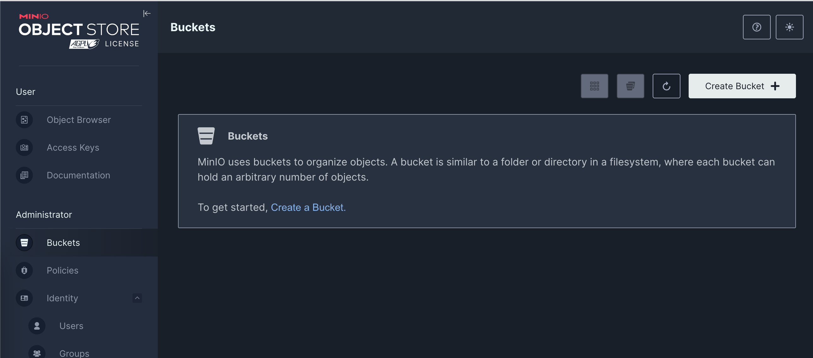
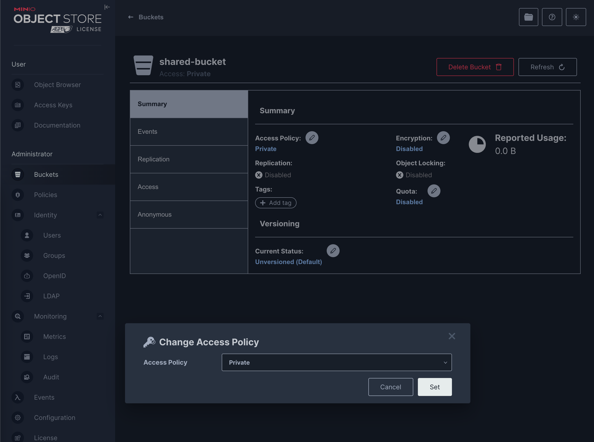
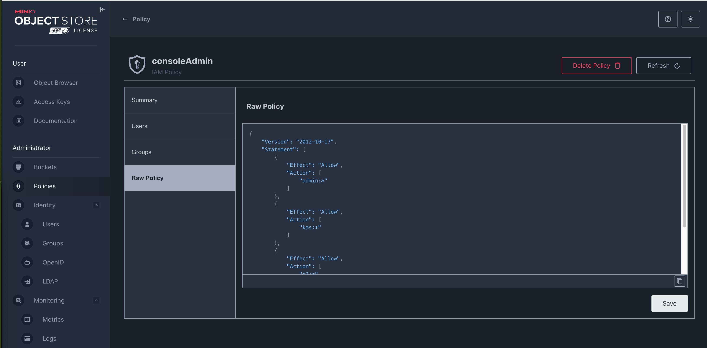

## 1. Install MinIO in Kubernetes

This setup is used for development purposes. In production, Amazon S3 can be used instead.

```shell
helm repo add minio https://charts.min.io/
helm install minio minio/minio \
  --namespace minio \
  --create-namespace \
  --set rootUser=admin \
  --set rootPassword=supersecurepassword \
  --set persistence.enabled=true \
  --set persistence.size=10Gi
```

By default, the MinIO Helm chart deploys in distributed mode with 4 servers and 4 drives per server (i.e., 16 pods in
total), which is optimal for production high-availability setups. For local or development use, this is often overkill.

Local Development Helm:

```shell
helm repo add minio https://charts.min.io/
helm repo update

helm install minio minio/minio \
  --namespace minio \
  --create-namespace \
  --set mode=standalone \
  --set rootUser=admin \
  --set rootPassword=supersecurepassword \
  --set persistence.enabled=true \
  --set persistence.size=1Gi \
  --set resources.requests.memory=128Mi \
  --set resources.requests.cpu=100m
  --set 'service.ports[0].port=9000' \
  --set 'service.ports[0].targetPort=9000' \
  --set 'service.ports[1].port=9001' \
  --set 'service.ports[1].targetPort=9001'
```

To access MinIO from localhost, run the below commands:

```shell
export POD_NAME=$(kubectl get pods --namespace minio -l "release=minio" -o jsonpath="{.items[0].metadata.name}")
kubectl port-forward $POD_NAME 9000:9000 9001:9001 --namespace minio
```

You can now access MinIO server on http://localhost:9000.

- Username: `admin`
- Password: `supersecurepassword`

Follow the below steps to connect to MinIO server with mc client:

1. Download the MinIO mc client - https://min.io/docs/minio/linux/reference/minio-mc.html#quickstart

2.
```shell
   export MC_HOST_minio-local=http://$(kubectl get secret --namespace minio minio -o jsonpath="{.data.rootUser}" | base64 --decode):$(
   kubectl get secret --namespace minio minio -o jsonpath="{.data.rootPassword}" | base64 --decode)@localhost:9000
```


3. mc ls minio-local
---
Delete Existing Resources:

```shell
helm uninstall minio -n minio
```
---
## Install Minio CLi

1. Install MinIO Client:
```shell
brew install minio/stable/mc
```

2. Add your local MinIO server:
```shell
mc alias set local http://localhost:9000 admin supersecurepassword
```

# Create a system bucket

## Create a Shared Bucket
Using MinIO Web Console

- Open http://localhost:9001
- Log in with your admin credentials.
- Click "Buckets" → "Create Bucket"
- Name it with a system-specific format, e.g., shared-bucket

### **Ensure bucket is private.**



## Create a Generic Policy Template

Here is template policy that allows access to a specific prefix (folder) within the bucket [user-folder-access.json](s3-policy/user-folder-access.json).

```json
{
  "Version": "2012-10-17",
  "Statement": [
    {
      "Action": [
        "s3:GetObject",
        "s3:PutObject",
        "s3:DeleteObject"
      ],
      "Effect": "Allow",
      "Resource": "arn:aws:s3:::user-data/${user}/*"
    },
    {
      "Action": [
        "s3:ListBucket"
      ],
      "Effect": "Allow",
      "Resource": "arn:aws:s3:::user-data",
      "Condition": {
        "StringLike": {
          "s3:prefix": [
            "${user}/*"
          ]
        }
      }
    }
  ]
}
```
Use the MinIO UI or CLI:
```shell
mc admin policy create local user-folder-access ./s3-policy/user-folder-access.json
```

